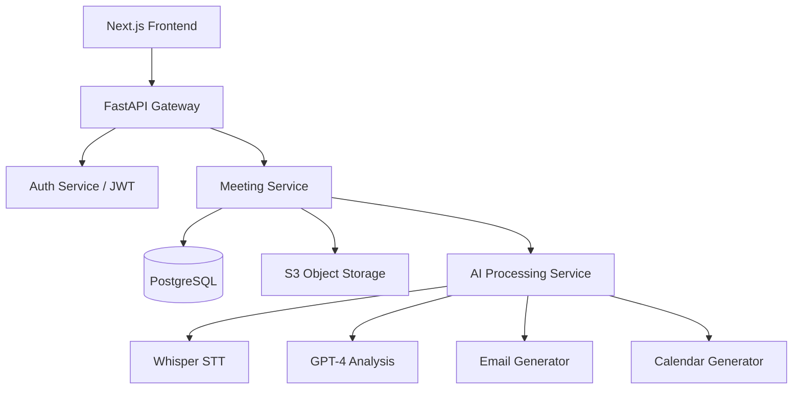

# System Architecture - AI Meeting Assistant

## 1. High-Level Architecture
The AI Meeting Assistant follows a microservices-inspired monolithic architecture for simplicity and scalability. It uses a modern stack:
- **Frontend**: Next.js (App Router) for a performant, SEO-friendly, and interactive UI.
- **Backend**: FastAPI (Python) for high-performance asynchronous API handling.
- **Database**: PostgreSQL with SQLAlchemy ORM and Alembic migrations.
- **AI Processing**: Integration with OpenAI (GPT-4o/o1) and Whisper (API or local) for transcriptions and analysis.
- **Task Queue**: Celery or BackgroundTasks for long-running AI processes.
- **Storage**: AWS S3 compatible storage for audio/video files and transcripts.

## 2. Component Diagram

## 3. Data Flow
1. **Upload**: User uploads a meeting file (MP3/MP4) via the Frontend.
2. **Storage**: Backend saves the file to S3 and creates a "Processing" record in Postgres.
3. **Transcription**: Background worker sends the file to Whisper for Speech-to-Text.
4. **Analysis**: The transcript is sent to GPT-4 to generate summary, action items, and email drafts.
5. **Completion**: Data is saved to the database, and the user is notified via WebSockets or polling.

## Multi-Provider AI Architecture
The system supports multiple AI providers for flexibility and cost-optimization.

### LLM Providers
- **OpenAI**: GPT-4o, GPT-3.5-Turbo.
- **Google Gemini**: Gemini 1.5 Pro/Flash.
- **OpenRouter**: Access to Llama 3, Claude 3, Mistral, and other open-source models via a single API.

### Implementation Pattern
We use the **Strategy Pattern** combined with a **Factory Pattern** to decouple the API endpoints from the underlying AI provider logic.
- `AIFactory`: Returns the requested provider instance.
- `LLMProvider (Base Class)`: Defines the standard interface for summary and action item extraction.

### Adding New Providers
1. Create a new class in `backend/app/services/ai/providers/`.
2. Inherit from `LLMProvider` or `TranscriptionProvider`.
3. Register the provider in `factory.py`.
